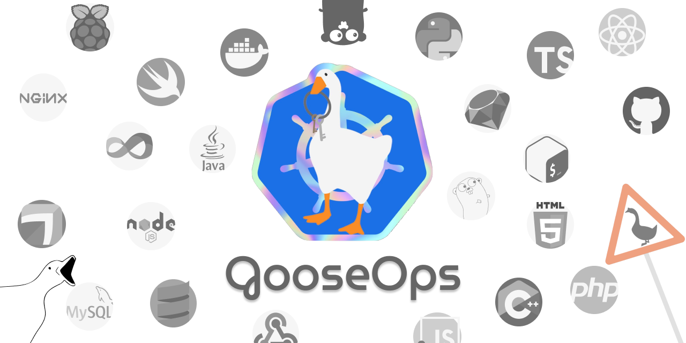
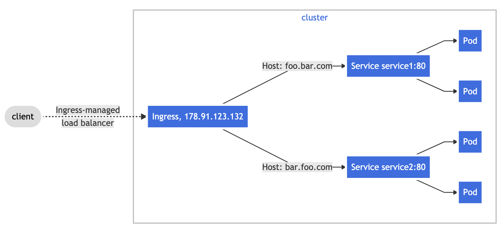

# Introducing GooseOps - Handy toolset for adopting DevOps practices

### Date And Time
Sat, February 27th, 2021 10:00 PM – 11:00 PM CET

- About us
- GooseOps
    - Goals
    - Docker
    - Kubernetes
    - Helm
    - Terraform
- Next Steps

# About us

**XTechnology** - *Educational Dev* open source project

## Goals

- learn new technologies
- share ideas and knowledge
- build online projects and community 🚀
- have fun! 👋

Copyright (c) 2021 x-technology

## [Andrew Red](https://twitter.com/mazahaco), [mazahaca](https://github.com/mazahaca)


👋 JavaScript, Node.js, Golang, DevOps @[Emma](https://github.com/emma-app)

## [🐦 Alex Korzhikov](https://twitter.com/AlexKorzhikov), [korzio](https://github.com/korzio)


👋 JavaScript, Golang, Java, DevOps @ING

## [Igor Smirnov](https://smithio.medium.com/)


👋 Data Science @Crayon

# GooseOps



## Idea
We want to develop a set of templates and use several tools, which can be easily used with a new or existing project to set up devops flows.

**DevOps** is a set of practices that combines software development (Dev) and IT operations (Ops). It aims to shorten the systems development life cycle and provide continuous delivery with high software quality.

## Goals

- Understand how `Docker`, `Kubernetes` works.
- Have a look into templating with `Helm`.
- Try `Terraform` language, and key features for automation.

## Docker

**Docker** is a set of platform as a service (PaaS) products that use OS-level virtualization to deliver software in packages called containers.

Containers are isolated from one another and bundle their own software, libraries and configuration files.

Dockerfile
```dockerfile
FROM alpine:3.4
CMD "Hello Goose"
```

Building an image
```shell
docker build -t xtechnology/goose-app:v1 .
```

Running docker container
```shell
docker run --rm -p 8080:80 xtechnology/goose-app:v1
```

Pushing image to registry
```shell
docker push xtechnology/goose-app:v1
```

## Kubernetes

Kubernetes is an open-source container-orchestration system for automating computer application deployment, scaling, and management

### Ingress
An API object that manages external access to the services in a cluster, typically HTTP



```yaml
apiVersion: networking.k8s.io/v1
kind: Ingress
metadata:
  annotations:
    kubernetes.io/ingress.class: nginx
spec:
  rules:
  - host: dev.goose.dev
    http:
      paths:
      - path: /
        backend:
          service:
            name: goose-app
            port:
              number: 80
```

### Deployment
```yaml
apiVersion: apps/v1
kind: Deployment
metadata:
  name: goose-app
  namespace: dev
spec:
  replicas: 1
  selector:
    matchLabels:
      app.kubernetes.io/name: goose-app
  template:
    metadata:
      labels:
        app.kubernetes.io/name: goose-app
    spec:
      containers:
      - name: goose-app
        image: xtechnology/goose-app:v1
        imagePullPolicy: IfNotPresent
        ports:
        - containerPort: 80
          name: http
          protocol: TCP
        resources: {}
```

```shell
kubectl --kubeconfig=${PWD}/.kube/config.yaml get namespace
```

```shell
helm template ../charts/goose-app | kubectl --kubeconfig=${PWD}/.kube/config.yaml apply -f -
```

## Helm

Helm is the best way to find, share, and use software built for Kubernetes.

```shell
helm template ../charts/goose-app
```

```shell
KUBECONFIG=${PWD}/.kube/config.yaml helm install goose-app ../charts/goose-app -n dev
```

```shell
KUBECONFIG=${PWD}/.kube/config.yaml helm upgrade goose-app ../charts/goose-app -n prod -f ../charts/prod-values.yaml --set "image.tag=v2" 
```


## Terraform

Terraform is an open-source infrastructure as code software tool

```shell
terraform plan
terraform apply
```

# Next Steps

- Automate CI/CD via Github
- Make templates of basic automation parts
- Think how to repeat the same automations on different projects

## Resources

- [kubectl cheatsheet](https://kubernetes.io/docs/reference/kubectl/cheatsheet/)

## Join us 13th of March, 2021

- [Andrew Red](https://twitter.com/mazahaco), [mazahaca](https://github.com/mazahaca)

- [🐦Alex Korzhikov](https://twitter.com/AlexKorzhikov), [korzio](https://github.com/korzio)

- [Igor Smirnov](https://smithio.medium.com/)

Copyright (c) 2021 x-technology

